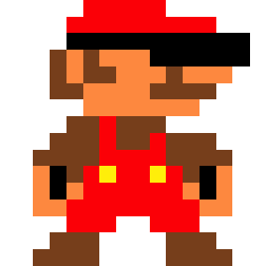

<p align="center">
    
</p>
<h1 align="center">Mario Kart Shooter VR</h1>

> A boilerplate for A-Frame 1.5, Vue 3.4 and Vite 5.0


## Warning

For the best VR experience for headset users, sit comfortably on the floor
or on a bed, adjusting the virtual floor height to match your seating
level. Use your headset's dedicated command to recenter your view before
clicking start. Also, make sure you have enough space and avoid standing
up or sitting down once the game has started.

### [>> DEMO <<](https://vr49.onivers.com/patrick/)

## Movement modes support

**Desktop**\
Keyboard for move (_WASD_ or Arrows keys) + Mouse for look control (Drag and drop)

**Mobile** \
1x Finger touch to go forward + 2x Fingers touch to go backward + Gaze cursor for click

**VR Headset** \
AR/VR walk + Teleport (Grip for grab and laser for click) + Gaze cursor for click

## Included

### Technologies

[**aframe-extras controls and animation-mixer**](https://github.com/c-frame/aframe-extras) \
 by [c-frame](https://github.com/c-frame) is licensed under [MIT License](https://github.com/c-frame/aframe-extras/blob/master/LICENSE)

[**aframe physx**](https://github.com/c-frame/physx) \
 by [c-frame](https://github.com/c-frame) is licensed under [MIT License](https://github.com/c-frame/aframe-extras/blob/master/LICENSE)

[**aframe-blink-controls**](https://github.com/jure/aframe-blink-controls/) \
 by [jure](https://github.com/jure) is licensed under [MIT License](https://github.com/jure/aframe-blink-controls/blob/main/LICENSE)

[**simple-navmesh-constraint**](https://github.com/AdaRoseCannon/aframe-xr-boilerplate) \
 by [AdaRoseCannon](https://github.com/AdaRoseCannon) is licensed under [MIT License](https://github.com/AdaRoseCannon/aframe-xr-boilerplate/blob/glitch/LICENSE)

### 3D models

[**Go Kart**](https://skfb.ly/6TuMD) \
 by [Samuel Thomas](https://sketchfab.com/SamuelTea) is licensed under [CC BY 4.0](https://creativecommons.org/licenses/by/4.0/)

[**Banana Peel (Mario Kart)**](https://skfb.ly/6EvGw) \
 by [Yanez Designs](https://sketchfab.com/Yanez-Designs) is licensed under [CC BY 4.0](https://creativecommons.org/licenses/by/4.0/)

[**Red Koopa Troopa Shell (Super Mario Bros)**](https://skfb.ly/6zRWI) \
 by [Yanez Designs](https://sketchfab.com/Yanez-Designs) is licensed under [CC BY 4.0](https://creativecommons.org/licenses/by/4.0/)

[**super mario star**](https://skfb.ly/oyQUJ) \
 by [gaelinix](https://sketchfab.com/gaelinix) is licensed under [CC BY 4.0](https://creativecommons.org/licenses/by/4.0/)

[**Goomba**](https://skfb.ly/oLEQV) \
 by [tirrellclark.75](https://sketchfab.com/tirrellclark.75) is licensed under [CC BY 4.0](https://creativecommons.org/licenses/by/4.0/)

[**Brick Block (Super Mario Bros)**](https://skfb.ly/6zQG9) \
 by [Yanez Designs](https://sketchfab.com/Yanez-Designs) is licensed under [CC BY 4.0](https://creativecommons.org/licenses/by/4.0/)

[**DS DSi - Mario Kart DS - Mario Circuit**](https://skfb.ly/optKO) \
 by [lonewolf1898](https://sketchfab.com/lonewolf1898) is licensed under [CC BY 4.0](https://creativecommons.org/licenses/by/4.0/) \
 Modifications: Finish line removed and replaced with road texture.

[**Lakitu**](https://skfb.ly/oBoZp) \
 by [Xen](https://sketchfab.com/XenMC) is licensed under [CC BY 4.0](https://creativecommons.org/licenses/by/4.0/) \
 Modifications: A white board has been added to allow Lakitu to display text.

[**Project Zomboid - Radio**](https://skfb.ly/oPvCA) \
 by [Phartam](https://sketchfab.com/Phartam) is licensed under [CC BY 4.0](https://creativecommons.org/licenses/by/4.0/)

### Audios

[**Countdown**](https://opengameart.org/content/countdown) \
 by [qubodup](https://opengameart.org/users/qubodup) is licensed under [CC BY 3.0](https://creativecommons.org/licenses/by/3.0/) \
 Modifications: Added the files together in the following order: countdown-a, countdown-a, countdown-b.

[**Starfishario**](https://opengameart.org/content/starfishario) \
 by [iamoneabe](https://opengameart.org/users/iamoneabe) is licensed under [CC 0](https://creativecommons.org/publicdomain/zero/1.0/)

[**Victory!**](https://opengameart.org/content/victory-1) \
 by [Viktor Kraus](https://opengameart.org/users/viktor-kraus) is licensed under [CC BY 3.0](https://creativecommons.org/licenses/by/3.0/) \
 Modifications: Cut to 2:38, fade in at the beginning.

[**The Fun Run! - Day 3**](https://opengameart.org/content/the-fun-run-day-3) \
 by [Zane Little Music](https://opengameart.org/users/zane-little-music) is licensed under [CC 0](https://creativecommons.org/publicdomain/zero/1.0/) \
 Modifications: Cut to 1:10.

[**Game Over**](https://opengameart.org/content/game-over) \
 by [Kistol](https://opengameart.org/users/kistol) is licensed under [CC 0](https://creativecommons.org/publicdomain/zero/1.0/) \
 Modifications: Cut by 0.4 second.

### Image

[**Les frères Mario**](https://www.favicon.cc/?action=icon&file_id=137640) \
 by [marcojetson](https://www.favicon.cc/?action=icon_list&user_id=36881) is licensed under [CC 0](https://creativecommons.org/publicdomain/zero/1.0/) \
 Modifications: Added a VR headset to Mario's head and two controllers.

## Attributions

This work is created by [Patrick Marques Meliciano](https://github.com/PatrickMarques24) based on code provided by [Nicolas Chabloz](https://github.com/Chabloz) during a [VR course at HEIG-VD](https://github.com/Chabloz/VR-A-Frame).

---

## Quickstart

### Create a folder for your project and move to it

### Clone (or fork, or download)

```sh
git clone https://github.com/PatrickMarques24/mario-kart-shooter-vr.git
```

### Install dependencies

```sh
npm ci
```

### Dev

```sh
npm run dev
```

### Build

```sh
npm run build
```

## Notes for local dev on VR headset

1. Check that your development device and your VR headset are connected on **the same network**.

2. Expose you local development:

```sh
npm run dev-expose
```

3. In your VR headset, browse to the local development adress `[ip]:[port]`.

> [!NOTE]  
> The certificate is self-signed, so you will probably have to confirm access to the resource in your browser.

---

## License


